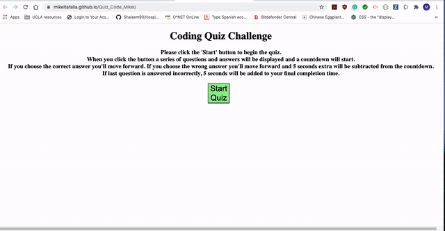

# Quiz_Code_Mikel

## Link
[Take the Quiz Code](https://mikeltafalla.github.io/Quiz_Code_Mikel/)

# Table of Contents

* [Technologies](#technologies)
* [Features](#features)
* [Instructions](#instructions)
* [Example Gif](#example-gif)
* [Author](#author)

### Technologies
1. Quiz created with html, css and js.
2. Quiz classifcation uses localstorage to store and display results

### Features
1. Start button to begin quiz
2. Buttons to click to choose the answer
3. Dynamic timer. Countdown from 15 to 0. It'll change if answer is wrongly answered.
4. Score counter (hidden until the end of th quiz)
5. Input button to enter our information as players.
6. Localstorage used to save and retrieve the information of the players, their scores and time of completion
7. Button to start over the game
8. Button to clean the localstorage and start over

### Instructions:
1. Page loads and a message with the instructions and a start button is displayed
2. Press the start button and the questions and time will start
3. When you click on an answer the questions will move on, no matter if your answer was right or wrong.
    * If your answer was right a message will appear stating so. One point will be added to your score (Score is not displayed until the end).
    * If your answer was wrong a red message will appear saying so. 5 seconds will be subtracted from your timer.
    * If you answer wrongly the last question. 5 seconds will be added to your final completion time

## Example Gif

## Author 

**MikelTafalla**

Email: mikel362d@gmail.com

Location: Santa Barbara

GitHub: https://github.com/MikelTafalla

